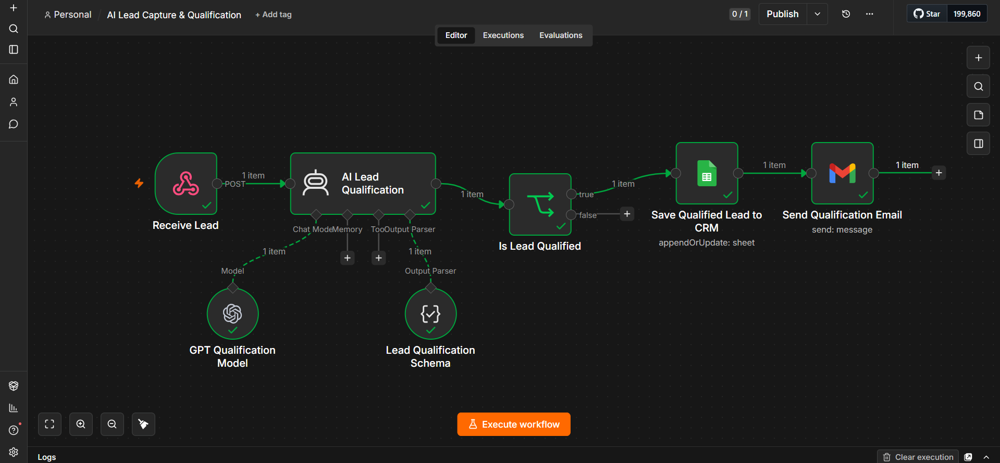

# AI Lead Capture & Qualification

An AI-powered lead capture and qualification automation built with n8n, OpenAI, Google Sheets, and Gmail.

This workflow automates the lead qualification process from the moment a potential customer submits their information. It uses AI to analyze the lead, determine qualification and priority, store qualified leads in a CRM-style Google Sheet, and send a personalized follow-up email automatically.

## Workflow Preview



## Key Features

- Capture leads through a Webhook
- Analyze leads using an AI Agent
- Qualify leads based on business requirements and budget
- Generate structured qualification results
- Assign a qualification score and priority
- Automatically determine whether a lead is qualified
- Store qualified leads in Google Sheets
- Send personalized follow-up emails through Gmail
- Reduce manual lead screening and follow-up work

## Tech Stack

- n8n
- OpenAI
- AI Agent
- Structured Output Parser
- Webhooks
- Google Sheets
- Gmail
- JSON
- n8n Expressions

## Workflow Architecture

```text
Receive Lead
     ↓
AI Lead Qualification
     ↓
Structured Qualification Output
     ↓
Is Lead Qualified?
     ↓
Save Qualified Lead to CRM
     ↓
Send Qualification Email
